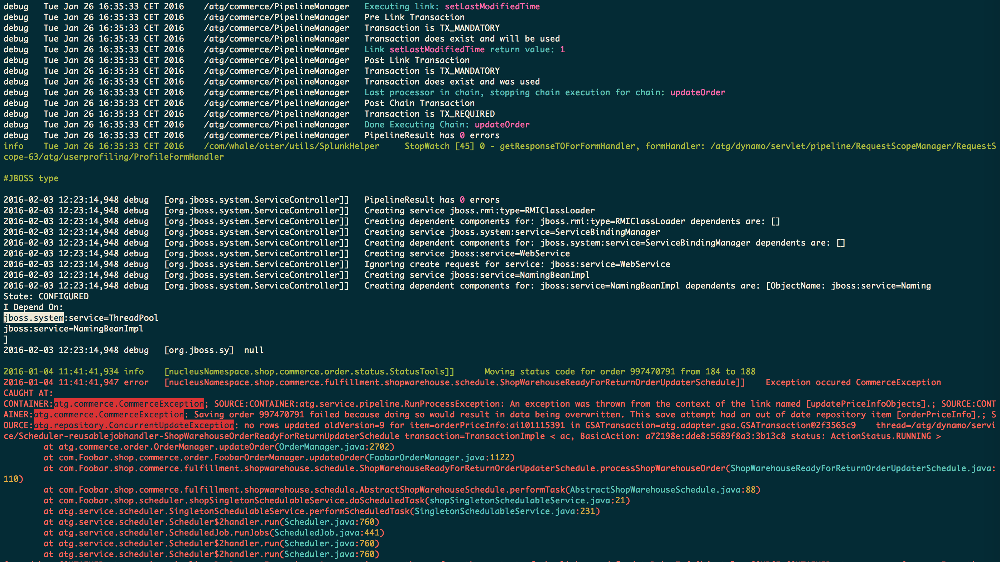

# Extended ATG Log Colorizer
===

An attempt at a more detailed colorizer than [Kelly Goetsch's classic tool]( http://atglogcolorizer.sourceforge.net ).

The goal it to highlight more than just log level : patterns like stacktraces, pipeline logs, and more

## Features
  - color each type of log level
  - highlight pipeline logs : keywords, chain names, return values
  - highlight stacktraces :  exceptions, class name & line number
  - highlight component names, some key atg logs (Nucleus Starting), key/value pairs (ex: order=o10000)
  - filter out elements of the logs, if one has no control over the output pattern

## Examples

With [solarized](http://ethanschoonover.com/solarized) terminal colors

## Install

`npm i -g atg-color`

## Usage:

The atg-color command reads from the standard output and writes a colorized log 

`tail -f dynamo.log | atg-color`

In order to use it with less, you must pass the -R flag to less, so that less applies the color codes.

`cat dynamo.log | atg-color | less -R`

## Disclamer - Known Limitations

### Functionnal 

atg-color is based on a parser that must recognize the whole line pattern. Small deviations in the pattern can lead the tool to fail to recognize a line. For now the recognized patterns are limited to ones I've encountered in the projects I worked on. With time the library of patterns will grow. I also intend on making the tool customizable (pattern & color schemes) so that anyone can easily adapt it to their needs.

### Performances

atg-color runs on nodejs, it's obviously slower than the original C++ tool. For now it looks fine.

## Changelog

### Todo

 - customizable patterns
 - customizable color scheme

## [0.0.6]
Added:
 -  sql block colorizing

## [0.0.2]
Fixed:
 - install

### [0.0.1] Initial Version
Added:

 - Level detection
 - Some basic patterns